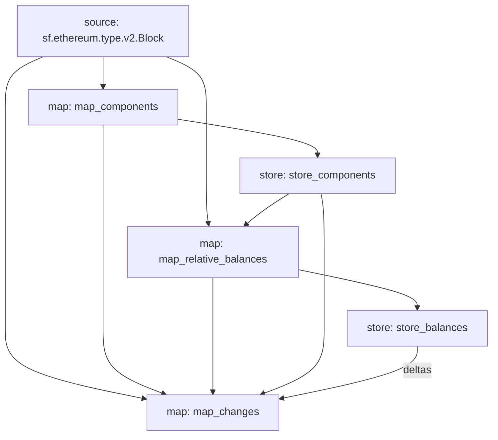

# Getting Started

## How to Integrate

Before starting, it is important to have a good understanding of the protocol we are aiming to integrate.

It is essential to understand:

- Which contracts are involved in the protocol and what functions do they serve. How do they affect the behaviour of the component being integrated?
- What conditions (e.g. oracle update) or what kind of method calls can lead to a relevant state change on the protocol, which ultimately changes the protocols behaviour if observed externally.
- Are there components added or removed, and how are they added. Most protocols use either a factory contract, which can be used to deploy new components, or they use a method call that provisiona a new component within the overall system.

Once the workings of the protocol are clear the implementation can start.

## Setup

PropellerHeads indexing integrations are provided as [substreams](https://substreams.streamingfast.io/) skpg files. If you do not know substreams yet, make sure to go check them out and set up their [cli](https://substreams.streamingfast.io/documentation/consume/installing-the-cli) before continuing.

Please start a new package for your integration, by copying the `ethereum-template` to a new name. The convention is: `[CHAIN]-[PROTOCOL_SYSTEM]` please make sure to also adjust: `cargo.toml` as well as `substreams.yaml` accordingly.

It should be possible now to generate the necessary protobuf code:

```bash
substreams protogen substreams.yaml --exclude-paths="sf/substreams,google"
```

Next please register the new package with the workspace by registering it as a workspace member. This is simply done by adding the package's name to the members list under `substreams/Cargo.toml`.

You are ready to start coding. The template you just copied already contains the `tycho-substreams` package as a dependency. This package contains all the necessary output types that tycho expects, as well as some interim helper types and functions for common tasks.

Before continuing though, it is important to understand the concept of map modules and store modules. You can read about those [here](https://substreams.streamingfast.io/documentation/develop/manifest-modules/types).

## Overview

In the following section, we outline the typical procedure for structuring an integration for the Virtual Machine (VM) implementation type:

Commonly, protocols employ factory contracts to deploy a contract for each swap component (also known as a pool or pair). We will explain how to efficiently index this system of contracts. It's important to note, however, that the techniques described below are broadly applicable, even if a protocol deviates from this specific pattern it should be possible to index it and emit the required messages.


The following examples and code snippets have been taken from the ethereum-balancer substream. The complete code is available [here](https://github.com/propeller-heads/tycho-protocol-sdk/tree/main/substreams/ethereum-balancer-v2).


Usually an integration consists of the following modules:

- `map_components(block)`
  - This map module extracts any newly created components by inspecting the block model (e.g factory contract logs). The recommended output model for this module is `BlockTransactionProtocolComponents.`
- `store_components(components, components_store)`
  - This store module takes the detected components and stores any necessary information about the component for downstream modules. For vm integrations the address is most likely enough.
- `map_relative_balances(block, components_store)`:
  - This map module is necessary for protocols that do not emit absolute balances changes (of ERC20 tokens and/or the native token). Since no absolute balances values are available the block model most likely will only provide deltas. Our sdk provides helpers to convert these into absolute balances as required by our data model. The responsibility of the module is to extract these relative changes and communicate them. The recommended output models for this module is `BlockBalanceDeltas`
- `store_balances(balance_deltas, balance_store)`:
  - This module stores the relative balances deltas in an additive store, which essentially converts them into absolute balances.
- `map_protocol_changes(balance_deltas, balance_store, components_store, ...)`:
  - The module that pulls everything together and build the final output model: `BlockChanges`.

The DAG formed by this structure can be seen below:



### Tracking Components

Usually the first step consists of detecting the creation of new components and storing their contract addresses in a store so they can be properly tracked further downstream.

Later we'll have to emit balance and state changes based on the set of currently tracked components.


Emitting state changes of components that have not been previously announced is considered an error.


Usually you want to start by implementing a map module that emits any newly created components. These newly created components are detected by inspecting the `sf.ethereum.type.v2.Block` model.

The output message should then contain as much information about the component available at that time, as well as the transaction that created the protocol component.

The recommended action here is to implement a `factory.rs` module that will help with detecting newly deployed components. Then use that module within a map handler to detect any newly emitted protocol components. The recommended output model for this first handler is `BlockTransactionProtocolComponents`:

```protobuf
// A message containing protocol components that were created by a single tx.
message TransactionProtocolComponents {
  Transaction tx = 1;
  repeated ProtocolComponent components = 2;
}

// All protocol components that were created within a block with their corresponding tx.
message BlockTransactionProtocolComponents {
  repeated TransactionProtocolComponents tx_components = 1;
}
```

Note that a single transaction may emit multiple newly created components. In this case it is expected that the `TransactionProtocolComponents.components` contains multiple `ProtocolComponents`.

Once emitted, the protocol components should be stored in a Store since we will later have to use this store to decide whether a contract is interesting to us or not.

### Tracking Absolute Balances

Tracking balances can be tricky since often balance information is only available in relative values.&#x20;

This means the relative values have to be aggregated by component and token to arrive at an absolute value. Additionally, throughout this aggregation we need to track the balance changes per transaction within a block.

Since this is challenging the following approach is recommended:

#### 1. Index relative balance changes

To accurately process a block and report the respective balance changes, implement a handler that utilises the `BlockBalanceDeltas` struct. It is crucial to ensure that each `BalanceDelta` within a component token pair is assigned a strictly increasing ordinal. This specificity is key to maintaining the integrity of aggregated values at the transaction level. Incorrect ordinal sequencing could lead to inaccurate balance reporting.

Below is an example of an interface for a handler. This handler interfaces with a store that employs an integer as an indicator to denote whether a specific address (identified by the keys) is a component.

```rust
#[substreams::handlers::map]
pub fn map_relative_balances(
    block: eth::v2::Block,
    components_store: StoreGetInt64,
) -> Result<BlockBalanceDeltas, anyhow::Error> {
    todo!()
}
```

Our Substreams SDK provides the `tycho_substream::balances::extract_balance_deltas_from_tx` function that extracts all relevant `BalanceDelta` from ERC20 `Transfer` events for a given transaction (see Curve implementation).

#### 2. Aggregate balances with an additive store

To aggregate `BlockBalanceDeltas` messages into absolute values efficiently while maintaining transaction level granularity, we can leverage the additive `StoreAddBigInt` type with a store module.

The `tycho_substream::balances::store_balance_changes` helper function is available for this purpose, streamlining the implementation significantly.&#x20;

Thus, the typical use case can be addressed with the provided snippet:

```rust
#[substreams::handlers::store]
pub fn store_balances(deltas: BlockBalanceDeltas, store: StoreAddBigInt) {
    tycho_substreams::balances::store_balance_changes(deltas, store);
}
```

#### 3. Combine absolute values with component and address

Last but not least, we have to associate the absolute balances with their respective transaction, component and token.

To simplify the final step of aggregating balance changes, utilise the `tycho_substream::balances::aggregate_balances_changes` helper function. Detailed instructions are available in the function's docstring. Essentially, it outputs aggregated `BalanceChange` structs per transaction. These aggregates can then be seamlessly integrated into `map_protocol_changes` for retrieving absolute balance changes associated with each transaction.

Below is a snip on how it is usually used:

```rust
#[substreams::handlers::map]
pub fn map_protocol_changes(
    block: eth::v2::Block,
    grouped_components: BlockTransactionProtocolComponents,
    deltas: BlockBalanceDeltas,
    components_store: StoreGetInt64,
    balance_store: StoreDeltas,
) -> Result<BlockChanges> {
    let mut transaction_contract_changes: HashMap<_, TransactionChanges> = HashMap::new();

    aggregate_balances_changes(balance_store, deltas)
        .into_iter()
        .for_each(|(_, (tx, balances))| {
            transaction_contract_changes
                .entry(tx.index)
                .or_insert_with(|| TransactionChanges::new(&tx))
                .balance_changes
                .extend(balances.into_values());
        });
}
```

### Tracking State Changes

In vm implementations, it's crucial to accurately identify and extract all relevant contract changes. Typically, there's a one-to-one mapping between contracts and components which allows us to follow the convention of utilising the hex-encoded address as the component's ID.

To facilitate the extraction of pertinent changes from the expanded block model, we recommend using the `tycho_substreams::contract::extract_contract_changes` helper function. This function significantly simplifies the process.

Below, we illustrate how to leverage a component store to define a predicate. This predicate serves to pinpoint the contract addresses that are of particular interest:

```rust
use tycho_substreams::contract::extract_contract_changes;

let mut transaction_contract_changes: HashMap<_, TransactionChanges> = HashMap::new();

extract_contract_changes(
    &block,
    |addr| {
        components_store
            .get_last(format!("pool:{0}", hex::encode(addr)))
            .is_some()
    },
    &mut transaction_contract_changes,
);
```
